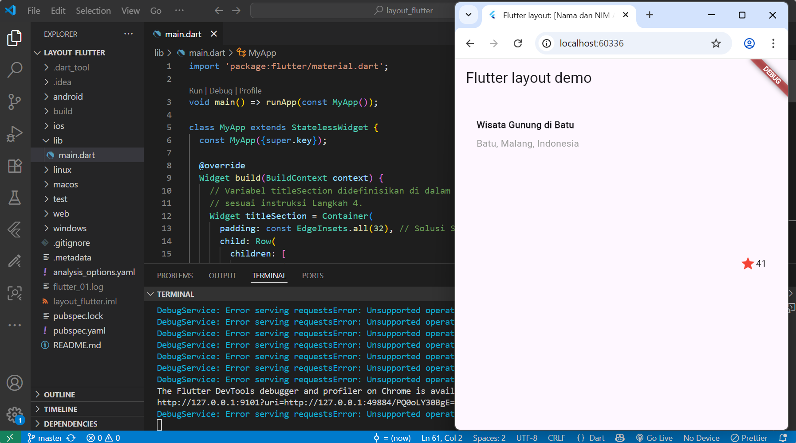
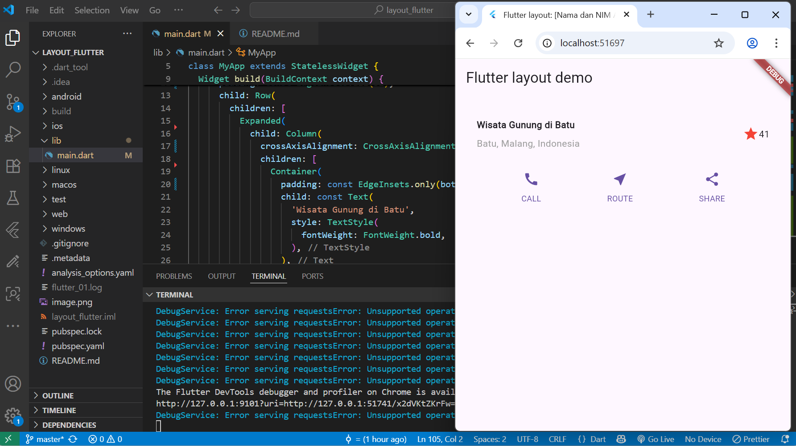
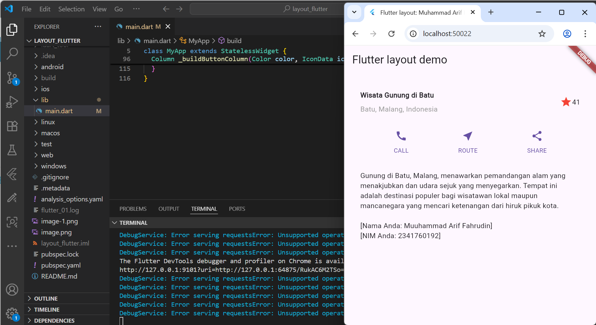
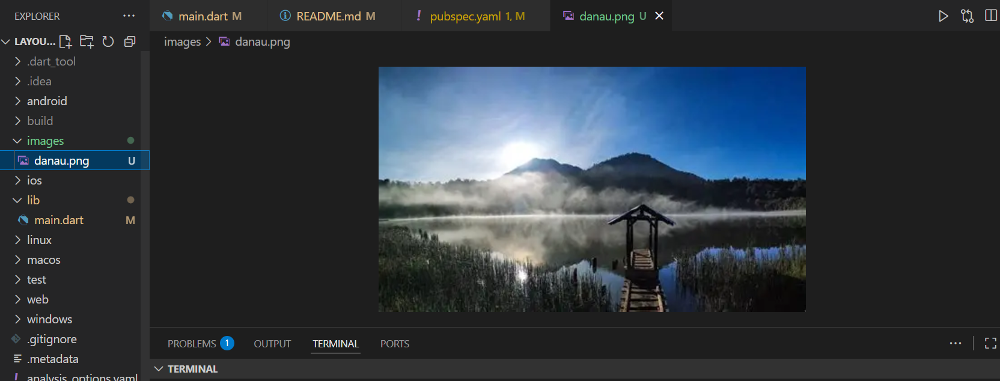
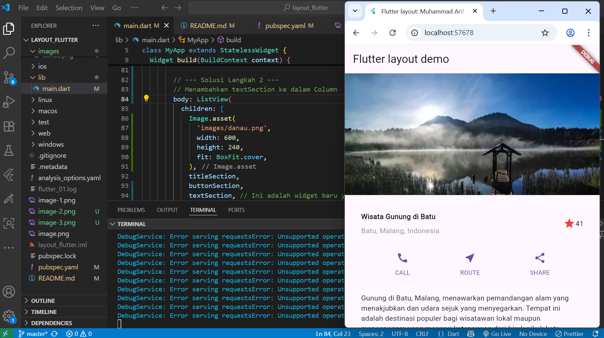

# layout_flutter
Praktikum 1
Membangun layout di flutter

Praktikum 2
Implementasi button row

A new Flutter project.

Praktikum 3
Implementasi text section

Praktikum 4
Menyiapkan image

Tambahkan image ke body dan mengubah column menjadi listview

## Getting Started

This project is a starting point for a Flutter application.

A few resources to get you started if this is your first Flutter project:

- [Lab: Write your first Flutter app](https://docs.flutter.dev/get-started/codelab)
- [Cookbook: Useful Flutter samples](https://docs.flutter.dev/cookbook)

For help getting started with Flutter development, view the
[online documentation](https://docs.flutter.dev/), which offers tutorials,
samples, guidance on mobile development, and a full API reference.
